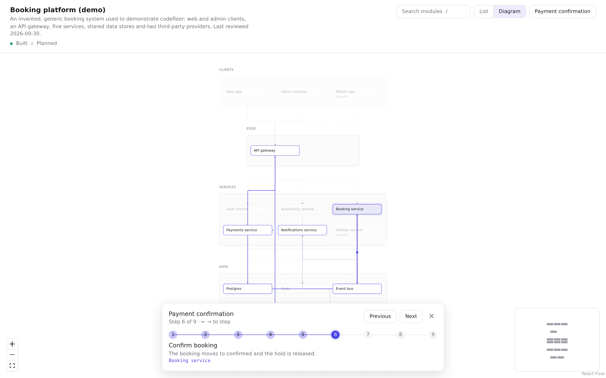
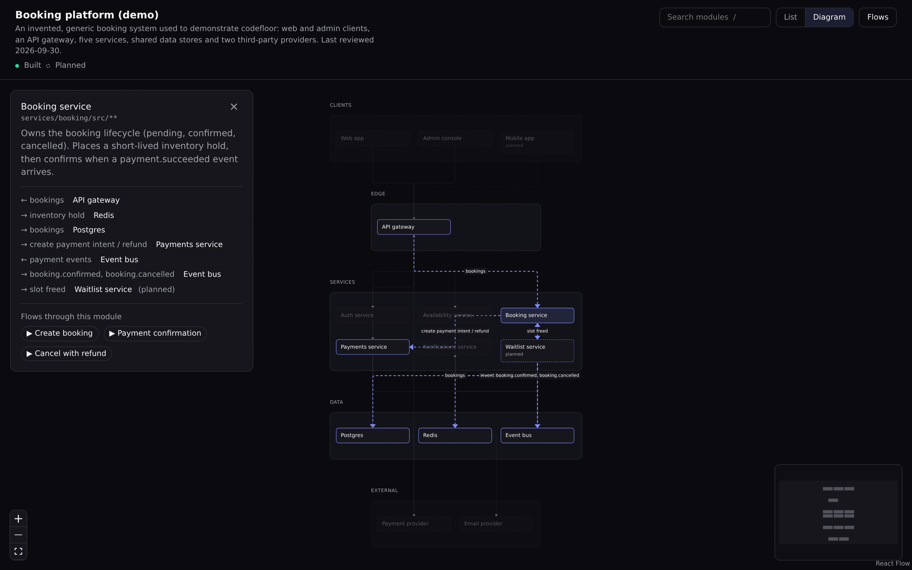
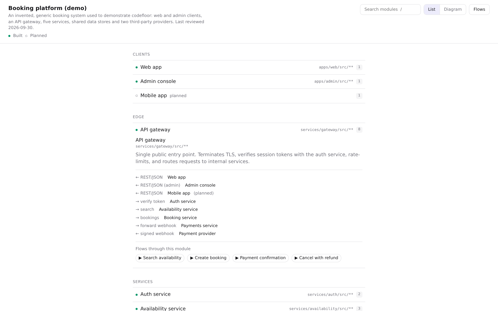

# codefloor

**Interactive architecture maps from a single JSON file.**

codefloor turns a `codefloor.json` document — layers, modules, edges and step-by-step flows — into an explorer you can click through: a searchable module list, a layered diagram, and guided walkthroughs of how a request moves through the system.



It ships as three packages and a Claude skill:

| Package | What it does |
|---|---|
| [`codefloor`](packages/cli) | CLI: extract a skeleton from a TS/JS repo, validate, build a static site, serve it locally |
| [`@codefloor/viewer`](packages/viewer) | The `<Codefloor />` React component (also prebuilt as a standalone app) |
| [`@codefloor/schema`](packages/schema) | Types, JSON Schema and a zero-dependency validator |
| [`skill/codefloor`](skill/codefloor) | A Claude skill that writes descriptions and flows, and keeps the map in sync |

## Quick start

Try the demo (an invented booking platform):

```bash
git clone https://github.com/gara501/codefloor.git
cd codefloor
npm install
npm run build
node packages/cli/dist/bin.js serve examples/booking-platform/codefloor.json
```

Open the printed URL. Press `/` to search, pick a flow from **Flows**, and step through it with `←` `→`.

## Screenshots

| Module details (dark theme) | List view |
|---|---|
|  |  |

Screenshots show the bundled [booking-platform demo](examples/booking-platform/codefloor.json).

## Map your own project

New here? Follow the [step-by-step tutorial](docs/tutorial.md): it maps a small sample app from scratch in about 20 minutes.

```bash
npx codefloor init                          # writes codefloor.config.json
npx codefloor extract --out codefloor.json  # modules + import edges from your code
npx codefloor validate codefloor.json --root .
npx codefloor serve codefloor.json
```

`extract` gives you the skeleton: modules, import edges and content hashes. Descriptions, non-code systems (databases, queues, third-party APIs) and flows are yours to write — or let the Claude skill do it.

### Configure modules

```json
{
  "root": "src",
  "tsconfig": "tsconfig.json",
  "layers": [
    { "id": "ui", "label": "Presentation" },
    { "id": "domain", "label": "Domain" },
    { "id": "infra", "label": "Infrastructure" }
  ],
  "modules": [
    { "id": "checkout", "label": "Checkout", "layer": "ui", "include": ["src/features/checkout/**"] },
    { "id": "api", "label": "API client", "layer": "infra", "include": ["src/lib/api/**"] }
  ]
}
```

The first matching rule wins. Unmatched files are grouped by their first folder under `root` and placed in the first layer.

### Keep it current

```bash
npx codefloor extract --against codefloor.json   # what changed since the map was written
npx codefloor validate codefloor.json --stale    # fail CI when the map drifts from the code
```

## Use the Claude skill

Copy the skill into your Claude skills folder:

```bash
cp -r skill/codefloor ~/.claude/skills/codefloor
```

Then ask Claude to "map this repo's architecture with codefloor" or "update codefloor.json". In update mode it only reads modules whose files changed, so refreshes stay cheap.

## Embed the viewer

```bash
npm i @codefloor/viewer react react-dom
```

```tsx
import { Codefloor } from "@codefloor/viewer";
import "@codefloor/viewer/codefloor.css";
import doc from "./codefloor.json";

export function ArchitecturePage() {
  return <Codefloor data={doc} theme="system" urlState />;
}
```

| Prop | Type | Default | |
|---|---|---|---|
| `data` | `unknown` | — | A `codefloor/v1` document. Invalid documents render a list of issues. |
| `theme` | `"light" \| "dark" \| "system"` | `"system"` | Colors come from `--cf-*` CSS variables you can override. |
| `urlState` | `boolean` | `false` | Mirror view and selection to `?view`, `?node`, `?flow`, `?step`. |
| `title` | `string` | document `name` | Header title. |
| `className` | `string` | — | Extra class on the root element. |

## Document format

```jsonc
{
  "name": "My app",
  "lastReviewed": "2026-09-30",
  "layers": [{ "id": "ui", "label": "Presentation" }],
  "nodes": [
    { "id": "web", "label": "Web app", "layer": "ui", "status": "built",
      "files": ["src/app/**"], "description": "What it does and what it owns." }
  ],
  "edges": [{ "id": "web->api", "from": "web", "to": "api", "kind": "http", "label": "REST", "status": "built" }],
  "flows": [
    { "id": "login", "name": "Log in", "description": "From form submit to a session.",
      "steps": [{ "node": "web", "label": "Submit form", "detail": "The user enters credentials." }] }
  ]
}
```

`status` is `built` or `planned` (planned items render dashed). Edge `kind` is one of `imports`, `calls`, `http`, `event`, `reads`, `writes`. The full JSON Schema is in [`packages/schema/schema.json`](packages/schema/schema.json); the design is in [`docs/design.md`](docs/design.md).

## Develop

```bash
npm install
npm run build      # schema → viewer (lib + app) → cli
npm test           # vitest + internal-term check
npm run lint       # biome
npm run typecheck
```

Requires Node 20+.

## License

[MIT](LICENSE)
