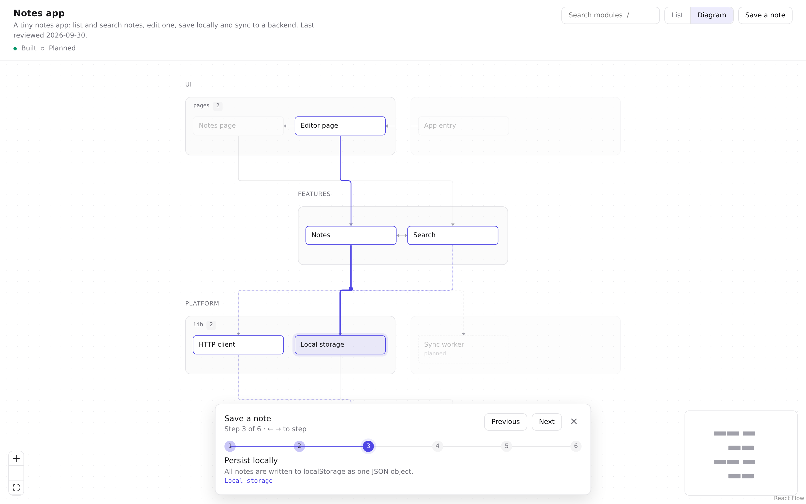

# Tutorial: map a project with the codefloor CLI

In about 20 minutes you will take a small TypeScript app, generate its architecture map, write the parts code analysis can't (descriptions, external systems, flows), check it, preview it, and keep it in sync after the code changes.



**You will learn to:**

1. Create a config and extract a first skeleton
2. Group files into meaningful modules and layers
3. Describe modules, add systems outside your code, and mark planned work
4. Write a step-by-step flow
5. Validate, preview and publish the map
6. Update the map when the code changes

## 0. Setup

You need Node 20 or newer.

Make the `codefloor` command available, one of two ways:

```bash
# from npm
npm i -g codefloor

# or from a clone of this repository
git clone https://github.com/gara501/codefloor.git
cd codefloor && npm install && npm run build
alias codefloor="node $PWD/packages/cli/dist/bin.js"
```

Then copy the sample app somewhere outside the repository so you can edit it freely:

```bash
cp -r examples/tutorial-app ~/notes-app   # from a clone; or download that folder from GitHub
cd ~/notes-app
```

The sample is a tiny notes app. Nothing needs to run; codefloor only reads the source:

```
src/
  main.ts                    entry point
  app/router.ts              picks a page from the URL
  pages/NotesPage.ts         list + search results
  pages/EditorPage.ts        edit one note
  features/notes/            notes store + API call
  features/search/           in-memory search index
  lib/http.ts                fetch wrapper
  lib/storage.ts             localStorage helpers
```

> Stuck at any point? The finished files are in [`examples/tutorial-app/solution/`](../examples/tutorial-app/solution).

## 1. First extraction

Create a config:

```bash
codefloor init
```

```json
{
  "root": "src",
  "tsconfig": "tsconfig.json",
  "layers": [{ "id": "modules", "label": "Modules" }],
  "modules": []
}
```

Extract with these defaults:

```bash
codefloor extract --out codefloor.json
```

codefloor reads every source file under `root`, resolves imports with the TypeScript compiler (including the `@/` alias from `tsconfig.json`), and groups files by their first folder. You get five modules:

```
app       ["src/app/**"]
features  ["src/features/**"]
lib       ["src/lib/**"]
main      ["src/main.ts"]
pages     ["src/pages/**"]

edges: app->pages, features->lib, main->app, pages->features
```

It works, but it's not very useful: *notes* and *search* are hidden inside one `features` box, and everything sits in a single layer. That's what the config is for.

## 2. Modules and layers

A good module is something you'd name in a conversation about the system: a feature, a page, a shared library. A good layer is a band of modules at the same level: UI on top, infrastructure at the bottom.

Replace `codefloor.config.json` with:

```json
{
  "root": "src",
  "tsconfig": "tsconfig.json",
  "layers": [
    { "id": "ui", "label": "UI" },
    { "id": "features", "label": "Features" },
    { "id": "platform", "label": "Platform" }
  ],
  "modules": [
    { "id": "entry", "label": "App entry", "layer": "ui", "include": ["src/main.ts", "src/app/**"] },
    { "id": "notes-page", "label": "Notes page", "layer": "ui", "include": ["src/pages/NotesPage.ts"] },
    { "id": "editor-page", "label": "Editor page", "layer": "ui", "include": ["src/pages/EditorPage.ts"] },
    { "id": "notes", "label": "Notes", "layer": "features", "include": ["src/features/notes/**"] },
    { "id": "search", "label": "Search", "layer": "features", "include": ["src/features/search/**"] },
    { "id": "http", "label": "HTTP client", "layer": "platform", "include": ["src/lib/http.ts"] },
    { "id": "storage", "label": "Local storage", "layer": "platform", "include": ["src/lib/storage.ts"] }
  ]
}
```

How rules work:

- `include` takes globs. A file belongs to the **first** rule that matches it.
- Files no rule matches still show up, grouped by folder and placed in the first layer. If you see an unexpected module, add a rule for it.
- Layers render top to bottom in the order you list them.

Extract again:

```bash
codefloor extract --out codefloor.json
```

```
edges: editor-page->notes, entry->editor-page, entry->notes-page, notes->http,
       notes->search, notes->storage, notes-page->notes, notes-page->search, search->notes
```

Take a look:

```bash
codefloor serve codefloor.json
```

Open the printed URL. The structure is right, but every module says `TODO: describe`. Press `Ctrl+C` to stop the server.

> `notes->search` and `search->notes` both exist: *search* imports the `Note` type from *notes*. Type-only imports count, because they are real coupling.

## 3. Describe the modules

Open `codefloor.json`. Each node looks like this:

```json
{
  "id": "notes",
  "label": "Notes",
  "layer": "features",
  "status": "built",
  "files": ["src/features/notes/**"],
  "description": "TODO: describe"
}
```

Replace every `TODO: describe` with one to three sentences: what the module does, what it owns, and one notable decision if there is one. Stick to what the code does, not what it might do.

```json
"description": "Owns the in-memory notes and their lifecycle. Saving writes to local storage, updates the search index, then pushes to the Notes API."
```

Also give the document a name and a one-line description at the top:

```json
"name": "Notes app",
"description": "A tiny notes app: list and search notes, edit one, save locally and sync to a backend.",
```

To find what's left:

```bash
grep -c "TODO: describe" codefloor.json
```

## 4. Add what the code can't show

Imports only reveal your own modules. The backend your app calls and the browser storage it writes to are just as important for understanding it. Add them as nodes **without** `files`, in a new layer.

Add the layer at the end of `layers`:

```json
{ "id": "external", "label": "External" }
```

Add three nodes to `nodes`. The last one is something the team intends to build; `status: "planned"` renders it dashed:

```json
{ "id": "notes-api", "label": "Notes API", "layer": "external", "status": "built",
  "description": "Backend that stores notes. Receives PUT /api/notes/:id with the full note as JSON." },
{ "id": "browser-storage", "label": "Browser localStorage", "layer": "external", "status": "built",
  "description": "Per-browser key-value store; notes survive reloads but not a new device." },
{ "id": "sync-worker", "label": "Sync worker", "layer": "platform", "status": "planned",
  "description": "Planned: retry failed saves in the background when the device is back online." }
```

Connect them with edges. `kind` says what travels on the edge (`imports`, `calls`, `http`, `event`, `reads` or `writes`); `label` says it in words:

```json
{ "id": "http->notes-api", "from": "http", "to": "notes-api", "kind": "http", "label": "PUT /api/notes/:id", "status": "built" },
{ "id": "storage->browser-storage", "from": "storage", "to": "browser-storage", "kind": "writes", "label": "notes", "status": "built" },
{ "id": "notes->sync-worker", "from": "notes", "to": "sync-worker", "kind": "calls", "label": "queue failed save", "status": "planned" }
```

Only mark something `planned` when there's written evidence for it (a ticket, a design doc, a TODO). The map should never invent a roadmap.

## 5. Write a flow

Flows are what make the map worth opening: they answer "what happens when…?" one step at a time. Pick the path a real request or user action takes and list the modules it touches, in order.

Replace `"flows": []` with:

```json
"flows": [
  {
    "id": "save-note",
    "name": "Save a note",
    "description": "From typing in the editor to the note stored locally and on the server.",
    "steps": [
      { "node": "editor-page", "label": "Edit text", "detail": "The textarea fires change; the first line becomes the title." },
      { "node": "notes", "label": "Update the note", "detail": "saveNote puts the note in the in-memory map." },
      { "node": "storage", "label": "Persist locally", "detail": "All notes are written to localStorage as one JSON object." },
      { "node": "search", "label": "Re-index", "detail": "The note is added to the search index so it shows up in results." },
      { "node": "http", "label": "Push to server", "detail": "A PUT request sends the note as JSON." },
      { "node": "notes-api", "label": "Store remotely", "detail": "The backend saves the note; a non-2xx status becomes an error." }
    ]
  }
]
```

Tips:

- Step `label`: imperative, a few words. Step `detail`: one sentence on what happens there and why.
- A step doesn't need an edge between its modules. The viewer draws the path hop by hop anyway.
- The same module can appear more than once in a flow.
- Three to six flows cover most systems. The solution adds a second one, "Search notes".

## 6. Validate

```bash
codefloor validate codefloor.json --root .
```

```
✓ valid
```

`--root .` also checks that every non-glob path in `files` exists. Here's what a typo looks like (a step pointing at `serach`):

```
error flows[1].steps[2].node: unknown node "serach"
✗ 1 error(s), 0 stale module(s)
```

Errors name the exact place in the document. The command exits with `1` on errors, so you can use it in CI.

## 7. Preview and publish

Preview:

```bash
codefloor serve codefloor.json
```

Things to try:

- **List** view: click a module to see its connections and the flows through it.
- **Diagram** view: click a module to highlight its neighbours.
- **Flows** menu: pick "Save a note", then use `←` `→`, or click the numbered dots.
- `/` jumps to search; `Esc` clears the selection.
- The URL updates as you click (`?view=diagram&flow=save-note&step=3`), so you can share a link to an exact step.

To publish, build a static site and host the folder anywhere (GitHub Pages, S3, an internal file server):

```bash
codefloor build codefloor.json --out site
```

`site/` contains `index.html`, the viewer's assets and a copy of your `codefloor.json`. It needs no server-side code.

## 8. Keep it current

Maps rot when nobody notices they're out of date. codefloor stores a hash of each module's files in `meta.sources`, so it can tell you exactly what changed.

Simulate a change. Add a tags feature:

```bash
mkdir -p src/features/tags
cat > src/features/tags/index.ts <<'TS'
export function extractTags(body: string): string[] {
  return [...body.matchAll(/#(\w+)/g)].map((m) => m[1] ?? "");
}
TS
```

And use it from the notes store (`src/features/notes/notesStore.ts`):

```ts
import { extractTags } from "@/features/tags";

export interface Note {
  id: string;
  title: string;
  body: string;
  tags?: string[];
}
// …inside saveNote:
notes.set(note.id, { ...note, tags: extractTags(note.body) });
```

**Detect drift.** This needs no AI and is what you'd run in CI:

```bash
codefloor validate codefloor.json --stale
```

```
stale: notes
✗ 0 error(s), 1 stale module(s)
```

**See what changed:**

```bash
codefloor extract --against codefloor.json
```

```json
{
  "added": ["features"],
  "removed": [],
  "changed": ["notes"],
  "edgesAdded": ["notes->features"],
  "edgesRemoved": []
}
```

`features` is the fallback name for a file no rule matched. Add a rule for it to `codefloor.config.json`, before the `http` rule:

```json
{ "id": "tags", "label": "Tags", "layer": "features", "include": ["src/features/tags/**"] }
```

Run it again. The diff now speaks your language:

```json
{ "added": ["tags"], "removed": [], "changed": ["notes"], "edgesAdded": ["notes->tags"], "edgesRemoved": [] }
```

**Apply it.** Touch only what the diff lists, and leave the rest of your hand-written map alone:

1. Add a `tags` node with a description (copy the skeleton from `codefloor extract` output).
2. Re-read `notes` and update its description if its behavior changed. Here it now extracts tags.
3. Add the edge `{ "id": "notes->tags", "from": "notes", "to": "tags", "kind": "imports", "status": "built" }`.
4. Check whether any flow passes through a changed module. "Save a note" does, so consider adding a step.
5. Copy `meta.sources` from a fresh `codefloor extract` into your document and bump `lastReviewed`.

```bash
codefloor validate codefloor.json --root . --stale
codefloor extract --against codefloor.json
```

```
✓ valid
{ "added": [], "removed": [], "changed": [], "edgesAdded": [], "edgesRemoved": [] }
```

The map is current again.

## Where to go next

- **Let Claude do the writing.** The [codefloor skill](../skill/codefloor/SKILL.md) runs steps 1–6 for you and, in update mode, only reads the modules the diff lists, so refreshes stay cheap.
- **Guard it in CI.** Add `codefloor validate codefloor.json --root . --stale` to your pipeline so drift fails the build.
- **Embed it.** Use `<Codefloor data={doc} />` from [`@codefloor/viewer`](../packages/viewer) inside your docs site or internal portal.
- **Look at a bigger example.** [`examples/booking-platform`](../examples/booking-platform/codefloor.json) has five layers, external providers and four flows.
